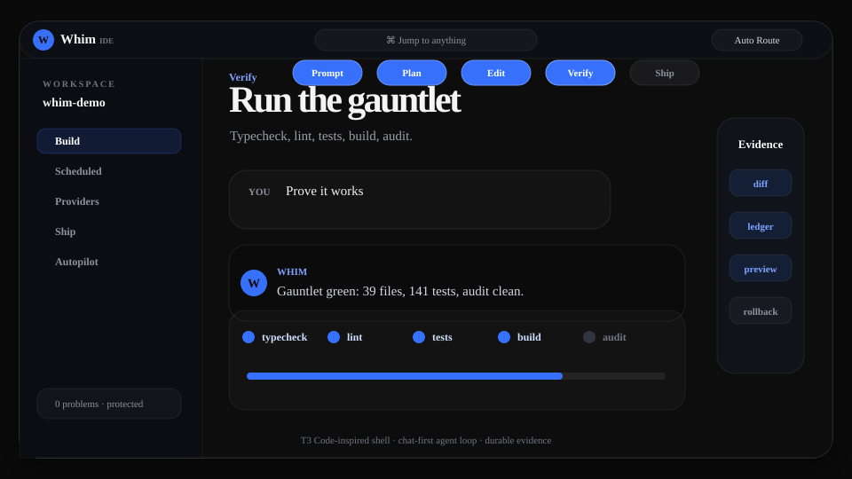
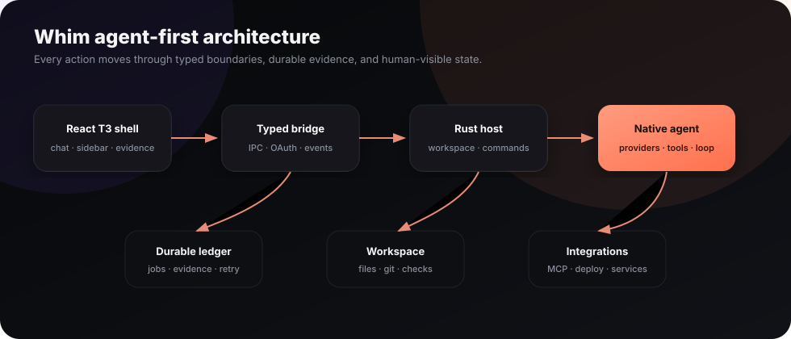
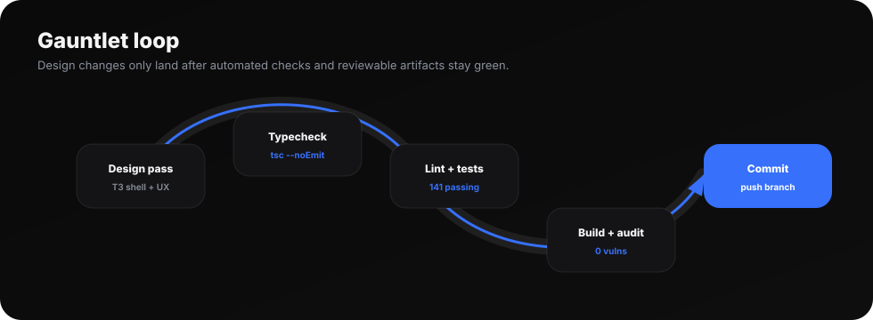
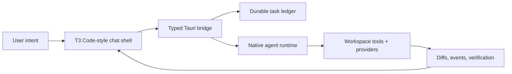
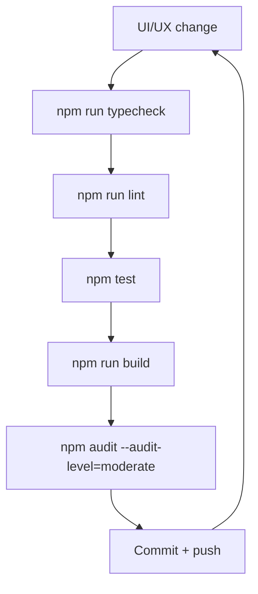

# Whim

**Build at the speed of intent — agent-first.**

Whim is a Windows-first desktop environment for a provider-neutral vibe-coding workflow, reshaped around the agent. Describe what you want, steer it naturally, and keep the path to deployment in the same workspace. The agent chat is the primary surface; the project file tree and a read-only file viewer are satellites around it — there is no editor and no simulated live preview.


## T3 Code design language

Whim's shell follows the T3 Code design language: a neutral near-black chrome (`#0a0a0a`), 6% hairline borders, `white/4%` hover surfaces, a 10px control radius, a floating glass composer, and a compact 256px sidebar. Every accent-aware surface (focus rings, active states, progress, buttons, command palette) resolves through the user's **Appearance → Accent** picker, which defaults to the T3 primary blue. No decorative gradients or glows — flat surfaces that keep the agent loop feeling fast without hiding state.

<p align="center">
  
</p>

The shell is organized like T3 Code: a compact 256px project rail on the left, a centered `max-w-3xl` conversation column, and a floating glass composer pinned at the bottom. Opening a file slides in a read-only viewer beside the conversation, and an optional context inspector tracks branch and change state.

### Product graphs

<p align="center">
  
</p>

<p align="center">
  
</p>





## Status

The application is a Tauri 2 Windows desktop app with a Rust backend and a React 19, TypeScript, Vite, Tailwind, and WebView2 interface. The agent chat drives the experience; the editor and simulated live preview were removed during the agent-first redesign so the layout reads like T3 Code / Claude Code Desktop. The main product surfaces are implemented, wired to the native bridge, and navigable:

| Surface | Implemented state |
| --- | --- |
| Build | Agent-first workspace: read-only project file tree, the agent conversation as the central surface, and a read-only file viewer when you open a file |
| Agent | Agent conversation with model selection, durable task ledger, attachable workspace files, and streaming tool evidence. Browser preview shows an explicit **Preview mode** notice; the native app invokes the real Whim agent |
| Providers | Provider hub, Windows toolchain discovery, credential-name discovery, in-app API-key entry, and provider model discovery |
| Ecosystem | Searchable MCP, skill, and IDE catalog with permission cards and workspace-local configuration |
| Ship Hub | Adapter catalog, project-aware native preflight for supported CLIs, readiness stream, and explicit human-owned production guard |
| Autopilot | Persisted automation preferences, environment discovery, safety-rule locks, and reviewable personalization surfaces |
| Commands | Searchable command palette (Ctrl+K) with keyboard navigation into the core product hubs |
| Chat | Private, tool-free conversation hub (Ctrl+Alt+N) with thread history, voice dictation, and workspace file attachments |

The Rust bridge also implements guarded workspace file access, PowerShell command execution, environment discovery, native agent prompts/models/sessions, deploy preflight, and confirmed CLI deployment commands.

## Current limitations

- No AI provider credentials or local model were configured during verification. Real agent runs require connecting a supported provider or a local model such as Ollama or LM Studio.
- Browser (Vite) preview is an interface shell: sending a message returns an explicit **Preview mode** notice instead of fabricating agent output. The installed Windows app runs the real native agent.
- The editor and simulated live preview were removed during the agent-first redesign. File browsing is read-only; there is no in-app code editing.
- A general plugin sandbox and a background automation engine are not implemented end to end; the Ecosystem catalog and several automation behaviors are interface surfaces backed by native configuration reads.
- Native deploy preflight and command adapters exist for Vercel, Netlify, Cloudflare, Render, Railway, Fly.io, and Docker. Azure, Windows packaging, and several broader deployment targets remain UI/spec-only.
- No production deployment was executed. Production promotion, billing, secrets, and destructive operations remain intentionally human-owned.
- A Windows x64 setup executable and standalone application were built and smoke-tested. The optional MSI bundler did not finish in this run, so MSI is not included.
- The `tauri::test` harness (`mock_builder`/`get_ipc_response`) cannot load in this sandbox because `WebView2Loader.dll` is absent. The agent-dispatch-vs-real-provider E2E therefore runs on a WebView2-capable machine; in this environment the orchestration lifecycle is covered by a runtime-free integration test over the real `DurableJobStore` + `BackendState`.

## Run the prototype

### Prerequisites

- Windows 10 or 11.
- A current Node.js LTS release and npm.
- For the desktop app: Rust with the stable MSVC toolchain, Microsoft C++ Build Tools with **Desktop development with C++**, and Microsoft Edge WebView2.

See the official [Tauri Windows prerequisites](https://v2.tauri.app/start/prerequisites/) for installation details.

### Install

```powershell
npm install
```

### Browser development

```powershell
npm run dev
```

Vite serves the interface at [http://localhost:1420](http://localhost:1420).

### Windows desktop development

```powershell
npm run tauri dev
```

This starts the Vite development server and opens the native Tauri window.

## Build

Build the frontend:

```powershell
npm run build
```

Build the Windows application and configured installers:

```powershell
npm run tauri build
```

Tauri writes release artifacts under `src-tauri/target/release/bundle/`. See the official [Windows installer guide](https://v2.tauri.app/distribute/windows-installer/) for MSI, NSIS, WebView2, and signing details.

## Latest frontend gauntlet

- `npm run check` — passed: TypeScript, ESLint, and Vitest.
- `npm run build` — passed.
- `npm audit --audit-level=moderate` — passed with 0 vulnerabilities.
- Current frontend suite: 34 test files and 125 tests passing, including an App-level smoke test that walks every hub, the command palette, settings categories, and the browser preview notice.
- Native Rust checks require a local Rust/MSVC/WebView2-capable Windows environment; this sandbox does not include Cargo.

Historical native verification from the Windows environment remains:

- `cargo fmt --check --manifest-path src-tauri/Cargo.toml` — passed.
- `cargo check --manifest-path src-tauri/Cargo.toml` — passed.
- `cargo test --manifest-path src-tauri/Cargo.toml` — passed, 63 tests in that run.
- `npm run tauri -- build --debug --no-bundle` — passed; built the native executable at `src-tauri/target/debug/workwhim-ide.exe`.
- Durable, neutral verification recording of lint/test/build results in the task ledger (`jobs.json`) verified under native runs.
- Enhanced layout readability and scaling tested and verified for 1920x1080 resolution screens.
- Browser verification covered Build/agent-first, agent send, Provider Hub, Ecosystem, Ship Hub, Autopilot, and the command palette.
- The release executable launched as **Whim IDE**, exposed the expected Windows accessibility controls, and closed cleanly.
- The NSIS x64 setup executable was generated successfully.

## Documentation

- [Product thesis, values, features, and metrics](./docs/product.md)
- [Architecture](./docs/architecture.md)
- [Agent harness: prompt, context, graph, and loop engineering](./docs/agent-harness.md)
- [Provider, plugin, and deployment ecosystem](./docs/ecosystem.md)
- [Trust and automation tiers](./docs/trust-and-automation.md)
- [Research and official sources](./docs/research.md)
- [Transformation roadmap and current delivery boundaries](./docs/roadmap.md)
- [Portable, restrictive project harness profiles](./docs/harness-profile.md)

## Project layout

| Path | Purpose |
| --- | --- |
| `src/` | React interface and interaction components |
| `src-tauri/` | Rust host, Tauri capabilities, packaging, and native configuration |
| `docs/` | Product and technical documentation |

## Product principle

Whim should automate everything that interrupts creative flow, while keeping every consequential action visible, attributable, portable, and reversible.
