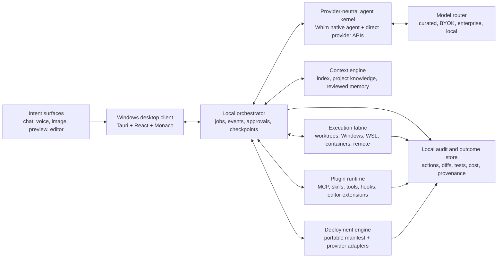

# Architecture

## Current prototype baseline

The repository now provides an interactive Tauri 2 application with a Rust host and a React 19, TypeScript, Vite, Tailwind, Monaco, and agent-chat interface. On Windows, Tauri renders the interface with the operating system's WebView2 runtime.

Implemented desktop surfaces include Build, Preview, Code, Changes, Mission Control, Provider Hub, Ecosystem, Ship Hub, Autopilot, a terminal drawer, and the command palette. The native bridge provides:

- guarded workspace selection, listing, relative file reads, and writes;
- Windows toolchain and credential-name discovery;
- confirmed PowerShell command execution;
- native agent prompt execution, provider routing, and model/session management;
- deploy preflight and confirmed CLI execution for Vercel, Netlify, Cloudflare, Render, Railway, Fly.io, and Docker.

The prototype does not yet provide the complete orchestrator, context engine, plugin sandbox, portable deployment manifest, or audit system shown below. No provider-backed AI run or production deployment was part of the verified snapshot.

## Target system

## Implementation map

| Component | Current prototype | Target gap |
| --- | --- | --- |
| Windows client | Implemented and browser-verified across all primary hubs | Deeper native notifications, packaging, and long-running reconnect behavior |
| Local orchestrator | Direct React-to-Tauri job calls and visible UI state | Durable queue, specialist scheduling, worktrees, checkpoints, budgets, cancellation |
| Agent kernel | Whim native agent: direct provider APIs, tool calling, event streaming, compaction | Richer streaming, typed permissions, remote sessions |
| Model router | Provider lanes and selectable model options | Outcome-aware automatic routing and failover |
| Context engine | Project UI context and sample journey | Repository index, living architecture, reviewed memory, freshness |
| Execution fabric | Guarded native paths and bounded command requests | Windows/WSL/container sandbox selection and ephemeral credentials |
| Plugin runtime | Searchable catalog, permission cards, local UI install state | Real package installation, signature verification, sandbox execution, rollback |
| Deployment engine | Seven native CLI preflight/execution adapters plus UI cards | Portable manifest, service provisioning, broader adapters, observed preview/production runs |
| Audit store | Terminal/readiness streams and local Autopilot preferences | Durable provenance, cost, outcome, approval, and recovery records |

## Component responsibilities

### Windows desktop client

- Owns the native window, navigation, editor, preview, task graph, terminal surfaces, and approval prompts.
- Uses Tauri commands and event streams to communicate with local services; provider credentials never pass through ordinary UI state.
- Integrates with Windows notifications, taskbar progress, file associations, Credential Manager, PowerShell, Command Prompt, Git Bash, and WSL.
- Remains responsive when agents run for a long time and can reconnect to an existing local or remote session.

### Local orchestrator

- Converts user intent into bounded jobs rather than one unstructured agent loop.
- Schedules specialists, creates isolated worktrees, enforces budgets and permissions, and emits typed progress events.
- Creates checkpoints before destructive or wide changes and records the relationship between request, actions, files, verification, and deployment.
- Can pause, cancel, retry, fork, or hand work back to the user without losing the session.

### Provider-neutral agent kernel

Whim runs its own provider-neutral coding agent. The agent calls provider chat APIs directly (OpenAI, Anthropic, Google, DeepSeek, Qwen, Xiaomi, and any OpenAI-compatible endpoint), executes tools inside the selected workspace, and streams typed events to the UI.

The design borrows patterns from leading code-agent harnesses:
- Explore → Plan → Implement → Verify workflow;
- Auto-compaction of conversation context;
- Project memory files (AGENTS.md, CLAUDE.md, GEMINI.md, README) auto-loaded;
- Read-only research sub-agent for codebase investigation;
- Verification loop: run build/test/lint and iterate until green;
- Multi-protocol provider abstraction.

A compatible internal interface must preserve:
- model identifiers in provider/model form;
- sessions that survive model switching;
- typed tool calls and permission outcomes;
- cancellation and streaming;
- importable and exportable transcripts;
- local and remote execution.

### Model router

- Matches task needs to model capabilities, privacy policy, latency target, reliability evidence, and cost ceiling.
- Offers a curated Whim lane for recommended provider/model combinations without making any gateway mandatory.
- Supports direct provider keys, existing subscriptions where allowed, enterprise gateways, OpenAI-compatible endpoints, Ollama, LM Studio, and other local runtimes.
- Makes routing reasons and estimated cost visible, and never silently weakens a user's privacy or quality constraint.

### Context engine

- Maintains a code index plus a compact living model of architecture, user journeys, terminology, design language, integrations, and constraints.
- Separates inferred session memory from reviewed, durable project rules.
- Retrieves context on demand instead of placing every rule, file, and tool schema in every prompt.
- Tracks freshness and proposes updates when code or decisions make knowledge stale.

### Execution fabric

- Gives every autonomous task an isolated working tree and explicit filesystem scope.
- Chooses the appropriate environment: native Windows, WSL, Dev Container, Windows Sandbox, remote development host, or cloud sandbox.
- Starts with no production credentials and default-deny network access, then grants narrow capabilities as needed.
- Produces reproducible environment metadata so another machine or CI runner can repeat the work.

### Plugin runtime

- Normalizes editor extensions, MCP servers, skills, agent tools/plugins, hooks, and deployment adapters behind one capability model.
- Loads tool definitions only when relevant to protect context capacity and latency.
- Runs executable plugins out of process where practical and mediates filesystem, network, process, credential, and UI access.
- Pins versions and supports disable, update, and rollback without corrupting the workspace.

### Deployment engine

- Detects the application shape and creates a portable deployment manifest.
- Resolves that manifest through adapters for cloud, container, Windows package, mobile-build, or self-hosted targets.
- Treats preview creation, production promotion, rollback, and teardown as distinct operations.
- Streams build and runtime evidence back into the same Whim task that initiated the release.

### Audit and outcome store

- Records prompts, model and tool identities, permission decisions, changed artifacts, tests, human approvals, deployments, and recovery actions.
- Stores locally by default with project-controlled export and retention.
- Measures time-to-working-outcome, rework, regressions, recovery, and cost rather than generated code volume.

## State boundaries

| State | Default home | Portability |
| --- | --- | --- |
| Source, tests, deployment manifests | Project repository | Standard Git |
| Durable rules and skills | Versioned project files | Agent-compatible formats |
| Session transcripts and checkpoints | Local Whim data store | Sanitized export |
| Provider and plugin secrets | Windows Credential Manager or approved vault | References only |
| Inferred personal preferences | Local user profile | Explicit opt-in export |
| Team policy | Signed, versioned policy package | Organization controlled |

## Windows-native contract

Whim runs as a compiled Tauri desktop application, not as a hosted web page. It uses the Windows WebView2 runtime. The Windows x64 application and NSIS setup executable were built successfully and the release app passed a native launch/accessibility/close smoke test. MSI remains configured as an optional packaging target but was not included in this verified snapshot. The frontend/orchestrator boundary remains explicit so Windows-specific surfaces can be replaced or extended with deeper native components without changing agent, plugin, or deployment protocols.

Development and packaging requirements are documented by Tauri in its [Windows prerequisites](https://v2.tauri.app/start/prerequisites/) and [Windows installer guide](https://v2.tauri.app/distribute/windows-installer/).
